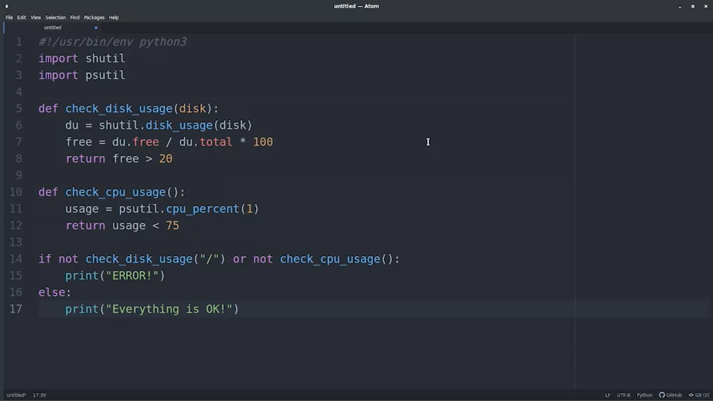

Look at IT Automatin like an IT Workforce Multiplier.
Automation allows the IT Infastructure to scale, and growth.

-- Think of manual automation, where it will be inefficient.

Scripting is a way to automate tasks that are repetitive and time-consuming. Such as:

Another Pro in Scripting is that it centralizes mistakes.

*Ways Automation can FAIL*
Tradeoffs:

Investigate:

Auotmation is fragile. Automation is a valuable asset, but be mindful on its use cases.

Bit-rot:

How can we avoid these silent failures?
- Build a modification method in the automation, so it will notify a person.

Sometimes an automation succeeds but does not work as intended. To 
avoid this:
- Use Periodic Tests to check on the behavior of the automation.
    - Can be automated too.

*Practical Automation Examples*
1. Checking your computer:
Manually:

Automating the Process:
-- Using ATOM

